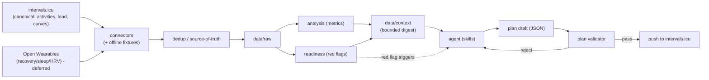

# Aithlete

Open-source triathlete analysis and AI training planning.

> **Python does the math, the agent does the judgment, JSON is the contract.**

Aithlete pulls your training and health data, compresses it into a small,
provenance-tagged "context digest", and lets an AI agent reason over it to
build and adjust a periodized triathlon plan. Every plan the agent produces is
checked by a **deterministic validator** before anything is pushed to your
calendar, and every training adjustment is **gated by a readiness/monitoring
module** so the AI can't ramp you into the ground.

> :warning: **Not medical advice.** See [`DISCLAIMER.md`](DISCLAIMER.md).

## Why this design

LLMs are great at judgment (interpreting trends, structuring a block, weighing
trade-offs) and bad at arithmetic and safety discipline. So Aithlete splits the
work:

- **Python** fetches data, deduplicates it across sources, computes/【fetches】
  training-load and physiology metrics, runs readiness checks, and **validates**
  any plan against hard rules (ramp caps, recovery weeks, taper shape, race-day
  form target, intensity distribution, weekly-hours tolerance).
- **The agent** (run as Cursor Agent Skills) reads a bounded context digest and
  authors/adjusts the plan as JSON.
- **JSON** is the only contract between them. The agent never sees raw streams
  and never computes a number that ends up in a plan.



## Data sources

| Concern | Canonical source | Notes |
| --- | --- | --- |
| Activities, streams, training load (CTL/ATL/TSB), power/pace curves, eFTP | **intervals.icu** | Fetched, not recomputed. |
| Recovery, sleep, HRV, RHR (Oura/Whoop) | **Open Wearables** | Deferred for v1; self-hosted unified API. |
| Workout delivery to the watch | **intervals.icu → Garmin** | Via intervals' native Garmin Connect sync. We never log in to Garmin directly. |

The whole pipeline runs **offline** against recorded fixtures + a synthetic
sample athlete, so you can try it with **no accounts or API keys**
(`AITHLETE_OFFLINE=true`, the default).

## Quickstart

```bash
# 1. Install (uv recommended)
uv sync --extra dev

# 2. Run the offline demo pipeline on the synthetic athlete
uv run aithlete fetch
uv run aithlete analyze
uv run aithlete readiness
uv run aithlete context

# 3. (later) point at your real intervals.icu account
cp .env.example .env   # add INTERVALS_API_KEY, set AITHLETE_OFFLINE=false
```

Then use the **Cursor Agent Skills** in `.cursor/skills/` to build a profile,
generate a plan, or adjust one:

- `triathlete-profile` — analyse history → `data/profiles/athlete.json`
- `training-plan` — generate a periodized plan (validated before push)
- `adjust-plan` — revise the active plan (gated by readiness)

Each skill drives the CLI and reads the bounded digest; the agent supplies
judgment while Python supplies (and checks) the numbers.

## How the math works

All formulas are documented and cited in
[`knowledge/triathlon/notes.md`](knowledge/triathlon/notes.md). In short:

- **Per-sport stress scores** normalize to `100 = 1 h at threshold`: power TSS
  (Coggan), run rTSS / hrTSS, swim sTSS (CSS-based) — so combined load is additive.
- **Fitness/Fatigue/Form (CTL/ATL/TSB)** via the Banister impulse-response model
  (τ = 42 / 7). Fetched from intervals.icu when available; recomputed to validate.
- **Physiology anchors**: FTP/eFTP (Coggan), CP/W′ (Monod–Scherrer, Skiba),
  run critical speed / Riegel extrapolation, swim CSS, LTHR; VO2max and lactate
  threshold are always flagged `estimated` unless from a lab test.
- **Readiness**: HRV vs 60-day baseline ± SWC (Plews/Hopkins), RHR elevation,
  sleep debt, ACWR (Gabbett), monotony/strain (Foster), neck-check illness rule.

The two rulebooks — [`rules.yaml`](knowledge/triathlon/rules.yaml) (plan shape)
and [`readiness.yaml`](knowledge/triathlon/readiness.yaml) (daily go/no-go) — are
plain, tunable YAML that the deterministic Python guardrails enforce.

## Recovery data via Open Wearables (optional)

For real HRV/sleep/recovery from Oura/Whoop/etc., wire in the self-hosted
[Open Wearables](https://openwearables.io/) API — see
[`docs/open-wearables.md`](docs/open-wearables.md). Deferred for v1; the pipeline
runs without it.

## Testing

```bash
uv run pytest        # 31 tests: load math, dedup, readiness, validator,
                     # workout round-trip, and a golden-file context digest
uv run ruff check src tests
```

Tests are hermetic and offline. The context-digest golden test
(`tests/golden/context_digest.json`) locks the exact summary the agent reads.

## Project layout

```
src/aithlete/
  config.py          # env + paths
  connectors/        # intervals.py (canonical), openwearables.py, dedup.py
  analysis/          # metrics, readiness, profile_builder, context digest
  planning/          # validator (guardrails), workout_builder
  models/            # pydantic schemas (schema_version + provenance)
  storage/           # atomic JSON / CSV io, path conventions
  cli.py             # `aithlete fetch|analyze|readiness|profile|context|validate|push`
knowledge/triathlon/ # parameterized, validator-enforceable training rules
data/                # gitignored: raw/, profiles/, plans/, context/, fixtures/
tests/               # mocked connectors, property tests, golden-file digests
.cursor/skills/      # the three agent skills
```

## Status & roadmap

Early v1 (single athlete, offline-capable, intervals.icu push).

- [x] Offline pipeline on a synthetic athlete (no accounts needed)
- [x] Provenance-tagged profile, bounded context digest, readiness gate
- [x] Deterministic plan validator + intervals.icu workout push (idempotent)
- [ ] Live intervals.icu recording fixtures (vcr cassettes)
- [ ] Open Wearables recovery wired into readiness by default
- [ ] Pushing computed wellness (readiness / DFA-a1 / decoupling) back to intervals
- [ ] Multi-athlete support (coaching)

## Contributing

Issues and PRs welcome. Please keep the core contract intact: math and safety
live in Python (with tests), judgment lives in the agent, and JSON is the
boundary. New physiology formulas must cite a source in `knowledge/triathlon/`.

## License

MIT — see [`LICENSE`](LICENSE).
